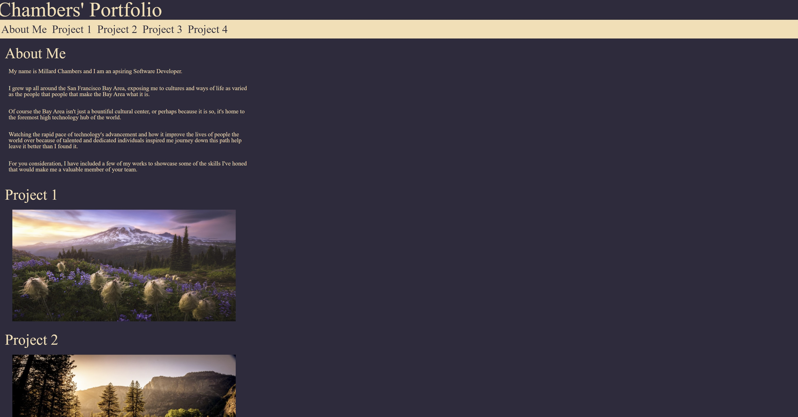
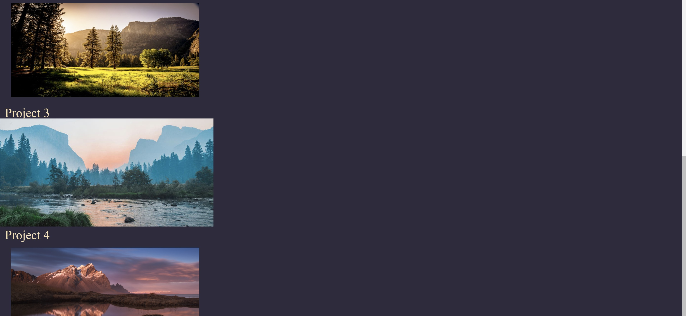

# html-portfolio-1
This is an early version of my personal portofolio. As of now it does not contain any projects within it but it will go on to display any works I think positively reflect on my abilities in the future for employers or anyone else interested in what I've been able to produce thus far.

# This is the link to the site deployed
https://mchambersiv.github.io/html-portfolio-1/

##
The navigation menu below the site name links to the About Me section and the current project placeholders on the site.

##
The image of each placeholder also enlarges when hovered over to highlight the item the user's attention is currently on.

##
This site is and will continue to be actively worked on so feel free to pop in every so often and judge the changes and additions I've made. Thank you for reading this far!
